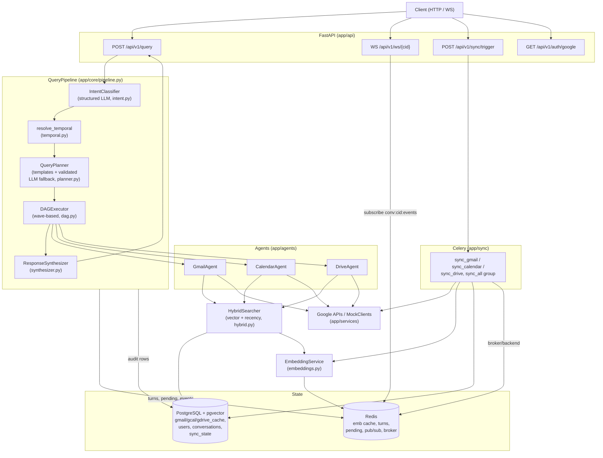

# Design: Agentic Google Workspace Orchestrator

This document describes the architecture of the orchestrator, the reasoning
behind the orchestration and retrieval design, and a concrete plan for scaling
the system to 1M users. Every claim here is grounded in the source; file paths
are cited so a reviewer can verify each statement against the code.

The system answers natural-language requests over a user's Gmail, Calendar, and
Drive. It classifies intent, plans a DAG of tool calls, executes that DAG with
bounded parallelism, and synthesizes a grounded answer. Writes (sending mail,
moving events, sharing files) are never executed without an explicit user
confirmation turn. There is no agent framework: the orchestration loop, the
planner, and the executor are all written from scratch and are unit tested
(65 test functions across `tests/unit` and `tests/integration`).

---

## 1. System overview

A single turn flows through `QueryPipeline.handle` (`app/core/pipeline.py`):

```
classify -> (confirm | clarify | chitchat) -> plan -> execute (DAG) -> synthesize
```

The pipeline owns no domain logic. It wires the intent classifier, the temporal
resolver, the planner, the DAG executor, the agents, the synthesizer, and the
Redis-backed conversation store into one coherent flow, publishes per-step
progress events onto a per-conversation pub/sub channel, persists each turn to
Postgres for audit and to Redis for short-term context, and returns a fully
JSON-serializable response envelope.

### Component diagram



Reads hit the local pgvector cache through `HybridSearcher`. Writes go to the
Google (or mock) client and are written through into the cache so a later read
in the same session sees them. Sync workers pull normalized records, embed them,
and upsert them into the cache tables.

---

## 2. Orchestration design

### Why classifier-LLM plus code-first templates plus a validated LLM fallback

The design splits responsibility between the model and code along the axis of
what each is good at.

- **The LLM classifies and extracts, it does not plan the common cases.**
  `IntentClassifier` (`app/core/intent.py`) uses a single structured-output call
  to turn the query plus the last few turns into an `IntentResult`: one of twelve
  intents, the services touched, extracted entities, and a `temporal_phrase`
  copied verbatim. The prompt explicitly forbids the model from computing dates;
  temporal reasoning is deferred to deterministic code.

- **Dates are resolved in code, not by the model.** `resolve_temporal`
  (`app/core/temporal.py`) converts phrases like "next week" or "in 3 days" into
  a timezone-aware `TimeRange`. This keeps date math testable and free of model
  drift, and it means the same phrase always resolves the same way.

- **The planner is code-first.** For the eight actionable intents, `QueryPlanner`
  (`app/core/planner.py`) emits a hand-written `ExecutionPlan` from
  `PLAN_TEMPLATES`. Each template is a pure function of
  `(intent, time_range, now)`, so it is fully deterministic and unit-testable,
  it costs zero tokens, and it cannot hallucinate an action or a parameter shape.
  `flight_cancellation`, `meeting_prep`, the three `*_search` intents, and the
  three `*_action` intents all have explicit templates.

- **The LLM plans only the open-ended case, and its output is validated.** Only
  `complex_multi_service` (requests that no template covers) is planned by the
  model. `_plan_complex` asks for an `LLMPlanOutput` against a documented
  canonical action surface (`_CANONICAL_ACTIONS_DOC`, `KNOWN_ACTIONS`), then
  `_validate_llm_plan` rejects the plan unless every step names a known agent and
  a known action, every `depends_on` id exists, and every `params_json` parses to
  a dict. If validation fails or the call raises, the planner falls back to
  `_safe_plan`: a read-only, three-service fan-out where every step is optional.
  The model is therefore never trusted blindly, and a bad plan degrades to a safe
  read rather than an error.

This split gives the deterministic guarantees a graded assignment wants (the
frequent flows are code, exercised by unit tests) while still handling arbitrary
multi-service requests through the model.

### Wave-based DAG executor

`DAGExecutor.run` (`app/core/dag.py`) executes a list of `PlanStep` nodes wired
by `depends_on`. It does not build an explicit graph object; instead it runs in
*waves*:

1. Compute the set of settled step ids.
2. Select `pending` steps (not yet settled) and, among those, the `ready` steps
   whose dependencies are all settled.
3. If nothing is ready but steps remain, raise `PlanError` (a cycle or an
   unsatisfiable dependency).
4. For each ready step, check `_blocking_reason`: a non-optional dependency in a
   blocking status skips the step immediately. Otherwise the step is runnable.
5. Run all runnable steps concurrently with
   `asyncio.gather(..., return_exceptions=True)` and settle their results.
6. Repeat until nothing is pending.

Key semantics:

- **Parallelism.** Independent steps in the same wave run concurrently. In
  `meeting_prep`, the calendar, gmail, and drive searches have no dependencies on
  each other and execute in one `gather`; the attendee follow-up depends on the
  meeting search and runs in a later wave.

- **Data flow with `{{step_id.path}}`.** Parameters may embed templates that are
  resolved against upstream results just before a step runs (`resolve_params`).
  `top` aliases `data["results"][0]`, and `[n]` indexes into lists. A string that
  is exactly one template yields the referenced object with its type preserved
  (so `{{find_meeting.top.attendees}}` resolves to a `list[str]`, which
  `_query_text` in `hybrid.py` then joins); a string with embedded templates has
  each match string-substituted. An unresolvable path settles the step as
  `failed` rather than crashing the run.

- **Fallbacks.** A step may carry a `fallback` step, executed inline when the
  primary comes back `empty` or `failed`. The fallback replaces the primary only
  if it ranks higher on `_STATUS_RANK`. `flight_cancellation` uses this: a narrow
  booking-confirmation search falls back to a broad airline search.

- **Optional steps.** An `optional` step that fails or comes back empty does not
  block its dependents. All `meeting_prep` searches and the entire `_safe_plan`
  fan-out are optional, so a partial data picture still produces an answer.

- **`expect_single` ambiguity.** When a step sets `expect_single`, an `ok` result
  with more than one row is downgraded to `ambiguous`. The three `*_action`
  templates locate their target with `expect_single`, so "move the meeting with
  John" against two matching events settles as `ambiguous` and blocks the
  mutation instead of guessing.

- **`requires_confirmation` write-safety.** A step marked
  `requires_confirmation` is *never executed*. It resolves its params and settles
  as `pending_confirmation`, carrying `{agent, action, params}`. The pipeline
  turns that into the single pending action offered to the user. Every mutating
  template step is confirmation-gated, and crucially, `_validate_llm_plan` forces
  `requires_confirmation=True` on any LLM-planned step that is not a
  `search_`, `get_`, or `draft_email` action. A model can propose a `send_email`
  or `delete_event`, but it can never cause one to run without a user's explicit
  "yes" turn.

- **Progress events.** `on_event(step_id, status)` fires `"running"` when a step
  starts and again with its final status when it settles, for every step
  including skipped ones. The pipeline fans these onto `conv:{cid}:events` in
  Redis, which the WebSocket endpoint (`app/api/routes/ws.py`) relays to the
  client. Event delivery is best-effort: a Redis hiccup is swallowed and never
  breaks the turn.

### Partial-failure philosophy

The executor settles every step to one of `ok | empty | failed | skipped |
ambiguous | conflict | pending_confirmation`; it never aborts the whole run
because one branch failed. The synthesizer then sees the full picture. Its
system prompt (`app/core/synthesizer.py`) instructs the model to ground the
answer only in the provided step digests, never to claim an action was taken
unless a result shows it, and to "state any failed or skipped steps plainly
rather than glossing over them." A `meeting_prep` where Drive returned nothing
and the attendee lookup was skipped still yields a useful answer that says so.
This honesty-about-gaps behavior is a deliberate product decision, not an
accident of error handling.

The confirm loop closes the write-safety story. `_handle_confirmation` reads the
pending action from Redis, runs it, and clears it. Every non-confirmation branch
(clarify, chitchat, execute) explicitly writes the pending slot (a fresh action
or `None`), so a stale action from an earlier turn can never be fired by a later
"yes".

---

## 3. Embedding and retrieval strategy

### What text is embedded, per source

The builders in `app/search/embed_texts.py` produce one compact, human-readable
block per record:

- **Gmail** (`email_embed_text`): `From: name <email>`, `Subject`, `Date`, then
  the cleaned body. `clean_email_body` strips HTML and drops quoted-reply cruft
  (`>` lines and `On ... wrote:` headers) so the vector reflects the new content,
  not the whole thread history.
- **Calendar** (`event_embed_text`): `Event` title, `When` (start to end),
  `Where` (location), `Attendees` (comma-joined emails), then the description.
- **Drive** (`file_embed_text`): `File` name, `Type` (mime), `Owner`, `Modified`,
  then the extracted content.

**Why attendee emails are embedded for calendar.** Putting the attendee list into
the embedded text means a semantic query about a person retrieves their meetings
even when the query never mentions the event title. `meeting_prep` relies on this:
the `attendee_emails` step feeds `{{find_meeting.top.attendees}}` back into a
gmail search, and calendar queries like "my sync with Priya" match on the
attendee block rather than requiring an exact title hit.

### Single-chunk v1 with truncation, and the chunking upgrade path

v1 embeds one vector per record from a single text block, with per-source
truncation to keep the block within a sensible token budget: email bodies at
6000 chars, file content at 4000, event descriptions at 2000 (see the slices in
`embed_texts.py`). Stored previews are separately capped at 500 chars
(`body_preview`, `content_preview`) in `app/sync/tasks.py`.

The upgrade path is deliberately non-breaking. Add a `chunk_index` column to each
cache table (the existing uniqueness constraint would become
`(user_id, <source>_id, chunk_index)`), split long documents into overlapping
chunks, embed each, and change retrieval to take the max score over a document's
chunks (`GROUP BY <source>_id`, `MAX(score)`). Nothing above the storage layer
changes: the agents and the DAG still see one row per document. This is why the
truncation limits live in the text builders rather than being baked into the
schema.

### Scoring: cosine blended with temporal decay

`HybridSearcher` (`app/search/hybrid.py`) scores each candidate as:

```
score = 0.8 * (1 - cosine_distance(embedding, qvec))
      + 0.2 * exp(-|age_seconds| / (86400 * 90))
```

The semantic term dominates (weight 0.8); recency (weight 0.2) breaks ties and
gently favors fresher material with a 90-day decay scale. `age_seconds` comes
from each table's recency column: `received_at` for mail, `start_time` for
events, `modified_at` for files.

**Why the absolute value for calendar.** Gmail and Drive rows are always in the
past, so their age is naturally positive. Calendar events are frequently in the
*future*, and a naive `now - start_time` would go negative and inflate the decay
term for events far ahead. Calendar recency uses `use_abs=True`
(`_recency_expr(..., use_abs=True)`), so an event two weeks out and an email two
weeks old decay symmetrically and upcoming events are not perversely ranked
above or below on the recency term alone.

### Hybrid: vector plus SQL metadata filters, with a pure-metadata fast path

Every search combines the vector score with SQL `WHERE` filters applied in the
same statement: `from_email` (ilike), `label` (array membership), date bounds for
gmail; `attendee` and `starts_after/before` for calendar; `mime_type`, `owner`,
and `modified_after/before` for drive. Filtering happens in the database, so the
vector ranking only ever competes over the rows that already match the
structured constraints.

When a query has no free-text component (for example a pure "what's on my
calendar next week" that reduces to a date-bounded lookup), the embedding step is
skipped entirely and rows are ordered purely by recency: calendar ascending by
start time, gmail and drive descending by recency. This **pure-metadata fast
path** avoids an embedding round-trip when semantics add nothing.

### Query-embedding cache (24h) and why

`EmbeddingService` (`app/search/embeddings.py`) caches every query embedding in
Redis under `emb:q:{sha256(model + ":" + text)}` with a 24h TTL, storing the
vector as raw float32 bytes. A query embedding is a pure function of
`(model, text)`, so the value never changes for a fixed model; caching it removes
a network round-trip and its dollar cost from the hot path whenever a query
repeats (common phrasings, retries, the same term reused across a conversation).
The 24h TTL bounds memory without risking staleness, since the value is
immutable for the model's lifetime. Batch misses are embedded 100 at a time
(`_BATCH_SIZE`) and each miss is written back. The same code path serves both the
async API (`embed`/`embed_batch`) and the sync Celery workers
(`embed_sync`/`embed_batch_sync`).

### ivfflat now, HNSW in production

The migration (`migrations/versions/0001_initial.py`) creates an ivfflat cosine
index (`vector_cosine_ops`, `lists = 100`) on each cache table's `embedding`
column. Honest caveat: at fixture scale (tens of rows per table) Postgres will
sequentially scan rather than use the ANN index, so recall is effectively 100%
and the index is inert. That is fine for the assignment and for correctness
testing, but ivfflat with a fixed `lists` also needs enough rows and a rebuild
after bulk loading to be well-tuned. The production choice is **HNSW** per
partition: it needs no `lists` tuning, degrades gracefully as the corpus grows,
and gives strong recall at low latency. The index type is a migration-level
decision that does not touch application code.

---

## 4. Caching strategy

Three Redis caches are implemented today, plus a write-through mechanism in
Postgres that provides read-after-write freshness. A short-TTL search-result
cache is a planned addition, listed here for completeness and clearly marked as
not yet built.

| Cache | Key | TTL | Invalidation | Status | Source |
|---|---|---|---|---|---|
| Query embeddings | `emb:q:{sha256(model:text)}` | 24h | Immutable for the model, TTL only | Implemented | `app/search/embeddings.py` |
| Conversation turns | `u:{user}:conv:{cid}:turns` | 24h | Capped at 5 (LPUSH + LTRIM), TTL refresh on append | Implemented | `app/core/context.py` |
| Pending action | `u:{user}:conv:{cid}:pending` | 30min | Overwritten or deleted every turn | Implemented | `app/core/context.py` |
| Fresh reads after a write | Postgres cache tables | n/a | Write-through upsert / delete on mutation | Implemented | `app/agents/calendar_agent.py` |
| Search results | `srch:{user}:{hash(params)}` | short (proposed) | epoch counter bumped on sync (proposed) | Planned, not in v1 | design only |

**Read-after-write freshness is real today, via write-through, not via a result
cache.** When the calendar agent creates or updates an event, it re-embeds and
upserts the row into `gcal_cache`; a delete removes the row
(`_write_through`, `_delete_event` in `app/agents/calendar_agent.py`). A search
issued later in the same session therefore reflects the mutation immediately,
because searches read the cache tables directly and no stale Redis copy sits in
front of them.

**Planned search-result cache.** For read-heavy production traffic the natural
addition is a short-TTL cache of serialized search results keyed by
`(user_id, normalized_params)`, invalidated by a per-user *epoch* counter that
each sync (and each write-through) increments; the epoch is folded into the cache
key so a bump makes every prior entry unreachable without an explicit delete.
This is not implemented in v1 and is not claimed to be; it is recorded here as
the intended next step so the freshness contract stays exact.

---

## 5. Task queue and sync

Background sync runs on Celery (`app/sync/celery_app.py`) with Redis as both
broker and result backend. `sync_all` fans out per service:

```python
group(sync_gmail.s(user_id), sync_calendar.s(user_id), sync_drive.s(user_id)).apply_async()
```

so the three services sync in parallel and independently. Each task shares
`_run_sync` (`app/sync/tasks.py`), which:

- loads the `User` and its per-service `SyncState` row and marks it `running`,
- fetches records newer than the stored **watermark cursor**
  (`state.last_synced_at`), or everything when `full=True`,
- builds embedding text, embeds the batch, and upserts via
  `INSERT ... ON CONFLICT (user_id, <source>_id) DO UPDATE`, so a re-sync updates
  rather than duplicates,
- records `items_synced` and stamps `last_synced_at` with the sync *start* time,
  flipping the state back to `idle` (or `error`, with the message persisted, on
  failure).

Datetimes are tz-aware end to end, so the `>=` watermark comparison never mixes
naive and aware values. The `sync_state` table also carries a `cursor` column,
reserved for the token-based sources below.

Reliability config (`celery_app.py`): `task_acks_late = True` so a task is
acknowledged only after it completes, meaning a worker crash mid-sync re-queues
the job rather than dropping it; `worker_prefetch_multiplier = 1` so a slow sync
does not hoard prefetched jobs; JSON serialization throughout.

For local use and tests, `POST /api/v1/sync/trigger?inline=true` runs all three
syncs in-process on worker threads (each drives its own event loop) instead of
dispatching to Celery (`app/api/routes/sync.py`).

**Upgrade path from polling to push.** v1 polls with a timestamp watermark. The
production design is event-driven and lives in the same `SyncState.cursor`
slot: Gmail `users.watch` with `historyId` delivered over Pub/Sub push, Calendar
`watch` channels, and Drive `changes` tokens. Workers then process actual change
notifications and are sized by change volume rather than by user count, which is
the difference between 1100 no-op polls per second and a handful of real deltas
(see section 7).

---

## 6. Security and multi-tenancy

- **User scoping on every read.** Every `HybridSearcher` query begins its `WHERE`
  clause with `<table>.user_id == user_id`, including `search_gmail`,
  `search_gcal`, `search_gdrive`, `get_by_source_id`, and `find_overlapping`
  (`app/search/hybrid.py`). There is no code path that reads another user's rows.
  Because reads are always user-scoped, this same property is what makes
  hash-partitioning by `user_id` a clean win at scale (section 7).

- **Conversation isolation.** `ConversationStore` is constructed with
  `scope=str(user.id)` and namespaces every key as `u:{user}:conv:{cid}:...`
  (`app/core/context.py`, `app/core/pipeline.py`). A caller who guesses another
  user's conversation id still cannot read that history or fire its pending
  action, because the key resolves only inside the caller's own namespace.

- **OAuth token storage.** Tokens are exchanged and refreshed via
  `app/services/google/oauth.py` and stored in `users.google_access_token` /
  `google_refresh_token`. These are plaintext `Text` columns
  (`migrations/versions/0001_initial.py`), which is acceptable for a local
  demo only. The production design is KMS envelope encryption: a per-tenant data
  key wraps the tokens at rest, the app decrypts just-in-time, and the plaintext
  never lands on disk. This is called out again in the limitations section.

- **Confirm before write.** No mutation executes without a user confirmation
  turn. Template mutations are `requires_confirmation`; LLM-planned mutations are
  force-confirmed by the validator (section 2). The pending action lives in Redis
  with a 30-minute TTL and is cleared or overwritten every turn.

- **Audit trail.** Every turn is persisted as a `conversations` row with the raw
  query, the classified intent (JSONB), the settled plan with per-step status,
  latency, and error (JSONB), and the final response (`_persist` in
  `pipeline.py`). This is a queryable record of what the assistant was asked, what
  it decided to do, and what happened.

- **Auth model.** The demo resolves the user from an `X-User-Email` header,
  falling back to a configured demo user (`app/api/deps.py`). This is explicitly a
  demo shim; production would sit behind real session auth or a verified OAuth
  identity, and the per-user scoping above is what the real identity would key on.

---

## 7. Scaling to 1M users

The load profile has an unusual shape: the query path is light, but per-user
document storage and sync fan-out are where the system breaks first. Sizing each
axis independently:

### Query QPS is small

1M users at roughly 5% daily-active is about 50k DAU. At about 10 queries per
active user per day that is about 500k queries/day, which is about **6 QPS on
average and roughly 100 QPS at peak**. That is trivially served by a handful of
stateless API pods behind a load balancer. The pipeline holds no per-request
state that is not in Postgres or Redis, so pods scale horizontally with no
affinity requirements. The compute cost per query is dominated by two model calls
(classify, synthesize) and one embedding call, all of which are I/O-bound and
async.

### Storage breaks first

Each user holds on the order of 6k documents (mail, events, files). Each
embedding is 1536 dimensions at 4 bytes:

```
6000 docs x 1536 dims x 4 bytes = ~37 MB of vectors per user
37 MB x 1,000,000 users        = ~37 TB total (vectors alone, before row bodies and indexes)
```

That does not fit one Postgres box. The fix follows directly from section 6:
because **every lookup is already user-scoped**, hash-partition by `user_id`
across N Postgres clusters (Citus, or application-level routing on a
`hash(user_id) % N` shard map). There are **zero cross-shard queries**: a query,
a sync, and an audit write all name exactly one user, so they all land on exactly
one shard. Within a shard, partition pruning keeps each user's ~6k-document
corpus small and fast regardless of total system size. An HNSW index per
partition (section 3) keeps vector search sub-linear within the shard.

### Sync fan-out must go event-driven

Polling 1M users every 15 minutes is `1,000,000 / (15 x 60)` which is about
**1100 jobs per second**, and the overwhelming majority are no-ops (nothing
changed). Paying 1100 QPS of Google-API traffic and worker wakeups to discover
"no change" is wasteful and will hit quota. The production design replaces
polling with push: Gmail `users.watch` plus `historyId` delivered via Pub/Sub
push, Calendar `watch` channels, and Drive `changes` tokens (the same tokens the
`SyncState.cursor` column already reserves). Workers then process real change
notifications only, so they are **sized by change volume, not user count**.

### Google API quotas

Google enforces per-project quotas (on the order of 250 quota units/second for
Gmail, for example). Defenses: a per-user token bucket so one heavy account
cannot starve others, batch endpoints where available to fetch many records per
call, exponential backoff with jitter on `429`/`5xx`, and negotiated quota
increases for the project. Push notifications also cut the base quota draw
because idle accounts generate no traffic at all.

### Embeddings at scale

An HNSW index per partition serves search. New-user backfill (embedding a full
mailbox on signup) goes through a **priority queue** that keeps interactive
embedding requests ahead of bulk backfill, and backfill uses the OpenAI **Batch
API** (roughly 50% cheaper) since it is latency-tolerant. The existing
query-embedding cache dedupes repeated text across users, so popular queries are
embedded once.

### Standard horizontal-scale tier

- **Redis Cluster**, splitting the cache role from the Celery broker/backend role
  so a broker backlog cannot evict hot cache entries.
- **Read replicas** per shard for the read-heavy query path.
- **Multi-region** deployment (US / EU / APAC) with users pinned to a home region
  for latency and data-residency, matching the per-user shard model.
- **KMS-encrypted tokens** at rest (section 6).
- **Per-user rate limiting** at about 100 queries/hour to bound abuse and cost.

### Monitoring targets

P99 query latency < 2s; cache hit rate > 80%; Google API error rate < 0.1%;
embedding freshness (change to searchable) < 15 minutes.

### Capacity table

| Axis | v1 (demo) | 1M users | Mechanism |
|---|---|---|---|
| Query rate | a few QPS | ~6 QPS avg, ~100 peak | stateless API pods + LB |
| Vector storage | tens of docs | ~37 TB (~37 MB/user) | hash-partition by `user_id`, N Postgres/Citus clusters |
| Per-user corpus | tens | ~6k docs | partition pruning + HNSW per shard |
| Sync work | inline / small group | ~1100 events/s worst case | Pub/Sub push (historyId / change tokens), not polling |
| Google quota | single project | 250 units/s per project | per-user token buckets, batch, backoff + jitter |
| Embedding backfill | inline | full mailbox on signup | priority queue, OpenAI Batch API, cache dedupe |
| Redis | single instance | cache + broker split | Redis Cluster, separate roles |

---

## 8. Honest limitations

- **Single-chunk embeddings.** One vector per document with truncation
  (6000 / 4000 / 2000 chars). Long documents lose their tail. The `chunk_index`
  upgrade in section 3 is designed but not built.
- **Timestamp watermark, not historyId.** Sync uses a `last_synced_at` watermark
  (`app/sync/tasks.py`). It is correct and idempotent (upsert on the unique key),
  but it cannot detect deletions on the source side and it re-lists a window
  rather than reading an exact delta. Gmail `historyId`, Calendar `watch`, and
  Drive change tokens are the fix, and the `cursor` column is already reserved for
  them.
- **Plaintext OAuth tokens in dev.** Tokens sit in plaintext `Text` columns
  (section 6). Acceptable for a local demo, not for production; KMS envelope
  encryption is the intended replacement.
- **Fake providers for offline mode.** With `LLM_PROVIDER=fake` and
  `EMBEDDINGS_PROVIDER=fake` the system runs fully offline and deterministically
  (`app/llm/fake.py`, `_fake_vector` in `embeddings.py`), which is what the test
  suite uses. Fake embeddings are unit-norm pseudo-random vectors seeded from the
  text: identical text collides correctly and the dimension contract holds, but
  they carry no real semantics, so relevance rankings under fake mode are not
  meaningful.
- **No search-result cache yet.** Only query embeddings, conversation turns, and
  pending actions are cached in Redis (section 4). Read-after-write freshness
  comes from Postgres write-through; the epoch-invalidated result cache is
  proposed, not implemented.
- **P@5 is only meaningful with real embeddings.** Any retrieval-quality target
  (for example P@5 on the fixtures) must be measured with
  `EMBEDDINGS_PROVIDER=openai`. Under fake embeddings the numbers reflect hash
  collisions, not semantic relevance, and should not be quoted as accuracy.
- **ivfflat is inert at fixture scale.** Postgres sequentially scans the tiny
  cache tables, so the ANN index does no work locally and recall is 100% for the
  wrong reason. HNSW per partition is the real production index (section 3).
