# Entity-Relationship Diagram

Source of truth: `app/db/models.py` (SQLAlchemy ORM) and
`migrations/versions/0001_initial.py` (the Alembic migration that actually
creates these tables/indexes in Postgres - verified identical to the models).
Vector columns require the `pgvector` extension (`CREATE EXTENSION IF NOT
EXISTS vector`, done at the top of the migration).

```mermaid
erDiagram
    USERS {
        uuid id PK
        varchar_255 email UK "NOT NULL"
        text google_access_token "nullable"
        text google_refresh_token "nullable"
        varchar_64 timezone "NOT NULL, default 'Asia/Kolkata'"
        timestamptz created_at "NOT NULL, default now()"
    }

    CONVERSATIONS {
        uuid id PK
        uuid user_id FK "nullable, -> users.id"
        text query "nullable"
        jsonb intent "nullable, IntentResult.model_dump()"
        jsonb plan "nullable, serialized plan steps + settled status"
        text response "nullable, synthesized answer"
        timestamptz created_at "NOT NULL, default now()"
    }

    GMAIL_CACHE {
        uuid id PK
        uuid user_id "NOT NULL, indexed (no DB FK)"
        varchar_255 email_id "NOT NULL"
        varchar_255 thread_id "nullable"
        text subject "nullable"
        varchar_320 from_email "nullable"
        varchar_255 from_name "nullable"
        text_array to_emails "nullable"
        text_array labels "nullable"
        text body_preview "nullable, cleaned body, truncated 500 chars"
        text embed_text "nullable, exact text that was embedded"
        vector_1536 embedding "nullable"
        timestamptz received_at "nullable"
    }

    GCAL_CACHE {
        uuid id PK
        uuid user_id "NOT NULL, indexed (no DB FK)"
        varchar_255 event_id "NOT NULL"
        text title "nullable"
        text description "nullable"
        text location "nullable"
        varchar_320 organizer_email "nullable"
        text_array attendee_emails "nullable"
        timestamptz start_time "nullable"
        timestamptz end_time "nullable"
        varchar_50 status "NOT NULL, default 'confirmed'"
        text embed_text "nullable"
        vector_1536 embedding "nullable"
        timestamptz updated_at "nullable"
    }

    GDRIVE_CACHE {
        uuid id PK
        uuid user_id "NOT NULL, indexed (no DB FK)"
        varchar_255 file_id "NOT NULL"
        text name "nullable"
        varchar_255 mime_type "nullable"
        varchar_320 owner_email "nullable"
        text content_preview "nullable, truncated 500 chars"
        text web_link "nullable"
        text embed_text "nullable"
        vector_1536 embedding "nullable"
        timestamptz modified_at "nullable"
    }

    SYNC_STATE {
        uuid id PK
        uuid user_id "NOT NULL (no DB FK)"
        varchar_20 service "NOT NULL, gmail|calendar|drive"
        varchar_255 cursor "nullable, UNUSED (see notes)"
        timestamptz last_synced_at "nullable, actual watermark used"
        varchar_20 status "NOT NULL, default 'idle', idle|running|error"
        integer items_synced "NOT NULL, default 0, count from LAST run only"
        text error "nullable"
    }

    USERS ||--o{ CONVERSATIONS : "user_id (FK enforced)"
    USERS ||--o{ GMAIL_CACHE   : "user_id (convention only, see notes)"
    USERS ||--o{ GCAL_CACHE    : "user_id (convention only, see notes)"
    USERS ||--o{ GDRIVE_CACHE  : "user_id (convention only, see notes)"
    USERS ||--o{ SYNC_STATE    : "user_id (convention only, see notes)"
```



## Keys and constraints, precisely

* **Primary keys**: every table uses a server-generated `uuid` `id`
  (`default=uuid.uuid4` in Python; Postgres itself has no default - the
  application always supplies the id on insert).
* **Only one real foreign key in the schema**: `conversations.user_id ->
  users.id` (`sa.ForeignKeyConstraint` in the migration). `gmail_cache`,
  `gcal_cache`, `gdrive_cache`, and `sync_state` all store `user_id` as a
  plain (non-null, but unconstrained) UUID column - there is **no**
  `ON DELETE CASCADE` or referential-integrity check tying them back to
  `users`. Deleting a user row would silently orphan their cache/sync rows.
  This is presumably intentional for a single-tenant/demo system, but it's a
  real gap if this were productionized with user deletion.
* **`UNIQUE(user_id, <source>_id)` upsert keys** - this is the mechanism
  that makes sync idempotent. Each cache table's unique constraint,
  `(user_id, email_id)` on `gmail_cache`, `(user_id, event_id)` on
  `gcal_cache`, `(user_id, file_id)` on `gdrive_cache` - is the conflict
  target for `INSERT ... ON CONFLICT DO UPDATE` in both the Celery sync path
  (`app/sync/tasks.py::_run_sync`, `_INDEX_ELEMENTS` maps each service to
  exactly these column pairs) and the calendar agent's write-through path
  after a live create/update (`app/agents/calendar_agent.py::_write_through`,
  `index_elements=["user_id", "event_id"]`). Re-syncing the same
  `email_id`/`event_id`/`file_id` for the same user updates the existing row
  in place rather than duplicating it. `sync_state` has the analogous
  `UNIQUE(user_id, service)`, so there is exactly one bookkeeping row per
  user per service.
* **Regular (non-unique) indexes**: `ix_gmail_cache_user_id`,
  `ix_gcal_cache_user_id`, `ix_gdrive_cache_user_id` - plain btree indexes on
  `user_id` so every per-user query (every search, every sync upsert) can
  seek instead of scan. `sync_state.user_id` has no dedicated index (only
  the composite unique constraint, which also serves lookups by
  `(user_id, service)`).
* **`sync_state.cursor`**: declared in both the model and the migration but
  never read or written anywhere in the codebase (verified - no `.cursor`
  reference outside the model/migration). The watermark that actually gates
  incremental syncs is `last_synced_at` (`_run_sync`: `watermark = None if
  full else state.last_synced_at`, compared against each mock client's
  `updated_after` filter). `cursor` looks like a placeholder for a future
  page-token/cursor-based incremental strategy that was never wired up.

## Vector columns and ivfflat indexes

`gmail_cache.embedding`, `gcal_cache.embedding`, and `gdrive_cache.embedding`
are all `vector(1536)` (`pgvector.sqlalchemy.Vector(1536)`), sized for
OpenAI's `text-embedding-3-small` (`settings.embedding_dim = 1536`) - the
fake-embeddings provider used for local/offline runs produces the same
dimensionality so the column type never has to change between modes
(`app/search/embeddings.py`). Each column stores the vector for
`embed_text` - a per-row, human-readable block built by
`app/search/embed_texts.py` (`From/Subject/Date/body` for mail,
`Event/When/Where/Attendees/description` for calendar,
`File/Type/Owner/Modified/content` for Drive) - **not** a vector of the raw
record; `embed_text` is stored alongside it precisely so the exact embedded
string is auditable.

Each of the three cache tables has an `ivfflat` approximate-nearest-neighbour
index for cosine distance, created with raw SQL in the migration (pgvector's
ORM integration doesn't yet expose `ivfflat` index creation, hence
`op.execute(...)` rather than `sa.Index(...)`):

```sql
CREATE INDEX ix_gmail_cache_embedding  ON gmail_cache  USING ivfflat (embedding vector_cosine_ops) WITH (lists = 100);
CREATE INDEX ix_gcal_cache_embedding   ON gcal_cache   USING ivfflat (embedding vector_cosine_ops) WITH (lists = 100);
CREATE INDEX ix_gdrive_cache_embedding ON gdrive_cache USING ivfflat (embedding vector_cosine_ops) WITH (lists = 100);
```

`lists = 100` clusters the vector space into 100 partitions for the
approximate search to probe - a reasonable default for a demo-scale table
(pgvector's own guidance is roughly `rows / 1000` lists for larger tables;
100 is fine well below ~100k rows per table, which comfortably covers this
project's fixture-scale data). The index uses `vector_cosine_ops` because
`app/search/hybrid.py::HybridSearcher` always ranks with
`embedding.cosine_distance(qvec)` - matching operator class to query
operator is required for the index to actually be used rather than falling
back to a sequential scan. Note that `ivfflat` indexes are built from
whatever rows exist *at index-creation time* (here, an empty table right
after the migration runs) and are refined as data is inserted; they are
approximate by design, which is consistent with this project's hybrid score
being a blend rather than an exact top-k semantic match. All three indexes
are optional to the *correctness* of a query - `HybridSearcher` always
issues a plain `ORDER BY score DESC LIMIT k`, which is correct with or
without the index; the index only changes whether Postgres can avoid
scanning every cached row per user to compute it.
